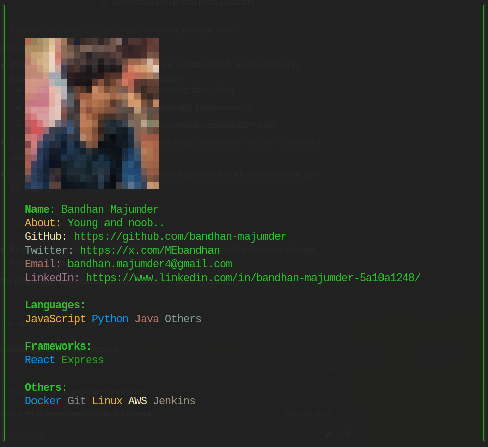

# NPM package for terminal portfolio

### package details: <https://www.npmjs.com/package/bandhanz?activeTab=readme>
### This is a simple terminal porfolio type package which contains the information of Bandhan Majumder.
### I am facing issues with showing profile picture accurately in every devices. In case you want to try with your photo and image locally, follow `main` branch
### Support me by typing `npx bandhanz`
### If you also want to publish your version of this, the resources are shared in `main` branch.. Thanks.